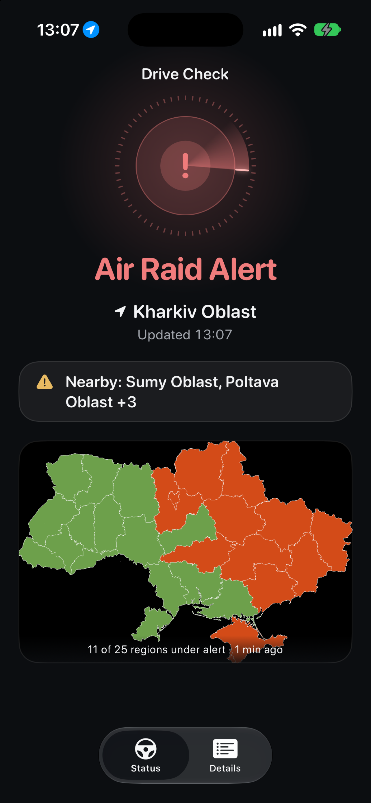

# Drive Check

Drive Check shows a driver in Ukraine whether their region is under an air raid alert, at a glance on CarPlay, the iPhone, a widget or a Live Activity, without a map to read or an account to create.

**Status:** on the [App Store as DriveCheckUA](https://apps.apple.com/app/id6793023910) · 3.1.0 in App Review

## How this app is built

- Coding agents do the work in fixed roles under one instruction file, [AGENTS.md](AGENTS.md); the owner approves every plan and requirement.
- Behaviour is specified first as Given/When/Then [requirements](docs/requirements/) with stable `REQ-` IDs, each approved by the owner with the date and the owner's words.
- Each change starts from a [task brief](docs/tasks/) with scope, acceptance and failure conditions, and design choices are kept as [decision records](docs/decisions/).
- One verification gate, `just verify`, runs the requirement-to-test trace, format, lint, build and all tests: every approved requirement must be cited by a test, and every test must pass.
- A separate reviewer pass checks each change for defects before it lands. The [commit history](https://github.com/vil4max/regional-check/commits/main) records why each change was made and what was verified.

## Stack

iOS 27+ · Swift 6 · SwiftUI · CarPlay · WidgetKit · ActivityKit (Live Activities) · App Intents · StoreKit 2 · Foundation Models · DriveCheckKit (SPM) · App Group · String Catalogs (en/uk/ru) · Swift Testing

## For contributors

Product boundaries live in [docs/core.md](docs/core.md). Current work and its order are in the [backlog](docs/planning/backlog.md), and each release has a note under [docs/operations/releases/](docs/operations/releases/).

- [Documentation index](docs/README.md) · [Architecture](docs/engineering/architecture.md) · [Surfaces & Pro](docs/requirements/surfaces-and-pro-gating.md) · [Subscriptions](docs/engineering/subscriptions-and-live-activity.md)

**Owner:** [vil4max](https://github.com/vil4max) · **Repo:** [vil4max/regional-check](https://github.com/vil4max/regional-check)
