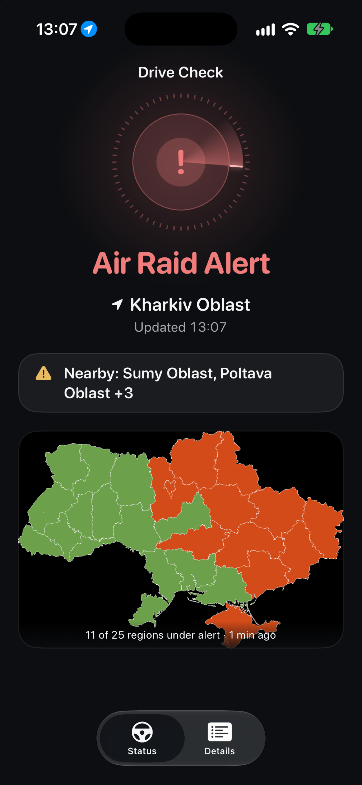

# DriveCheckUA

DriveCheckUA shows a driver in Ukraine whether their region is under an air raid alert, at a glance on CarPlay, the iPhone, a widget or a Live Activity, without a map to read or an account to create.

**Status:** on the [App Store](https://apps.apple.com/app/id6793023910) · 3.1.0 live since 2026-09-25



## Features

- **CarPlay:** one screen with the status, your region and when it was updated, nearby alerts only when there are any, and Refresh.
- **iPhone:** a Status tab with the region's status, a nearby-alert line and the alert map inline, and a Details tab with the summary and settings. The region always follows your location, and falls back to Kyiv without it.
- **Widgets, Control Center and Lock Screen:** the same status, with an explicit age and a stale marker when the data ages.
- **Live Activity:** starts when an alert is seen, stays when you leave the app, and ends on a confirmed all-clear.
- **Siri and Shortcuts:** ask for your region's alert status.
- **Stay Alert:** a yellow status when a quiet region is surrounded by alerts.
- English, Ukrainian and Russian. No account, no ads, no third-party analytics.

## Requirements

- iOS 27 or later
- Xcode 27 to build; [SwiftLint](https://github.com/realm/SwiftLint) to lint, in the version named in `.swiftlint-version`

## Build

Open `RegionalCheck.xcodeproj` in Xcode, or build and test from the command line:

```bash
xcodebuild build test -project RegionalCheck.xcodeproj -scheme RegionalCheck \
  -destination 'platform=iOS Simulator,name=iPhone 17' \
  -skipPackagePluginValidation -skipMacroValidation
scripts/spec-trace.sh   # requirement trace: every approved requirement is cited by a test
```

The two skip flags let `xcodebuild` run the Prefire build-tool plugin and the macros without the
one-time "Trust & Enable" prompt that only Xcode can answer. The same checks run in CI (`.github/workflows/tests.yml`). With the `ios-agentic-sdlc` Claude Code
plugin enabled, `ios-verify` runs project checks, lint, build and tests on a simulator of its
own. The full command list is in [AGENTS.md](AGENTS.md).

## Specification and tests

Behaviour is specified as Given/When/Then [requirements](docs/requirements/) with stable `REQ-` IDs, and design choices are kept as [decision records](docs/decisions/). Tests carry the requirement ID in their name, and every approved requirement must be cited by a test: `scripts/spec-trace.sh` checks this, and CI runs it before the tests.

For example, `REQ-REFRESH-003`, "One retry for transient errors", is defined in [docs/requirements/refresh-policy.md](docs/requirements/refresh-policy.md) and tested in [RegionalCheckTests/UbillingRetryTests.swift](RegionalCheckTests/UbillingRetryTests.swift).

## Stack

iOS 27+ · Swift 6 · SwiftUI · CarPlay · WidgetKit · ActivityKit (Live Activities) · App Intents · StoreKit 2 · Foundation Models · DriveCheckKit (SPM) · App Group · String Catalogs (en/uk/ru) · Swift Testing

## Documentation

Product boundaries live in [docs/core.md](docs/core.md).

- [Documentation index](docs/README.md) · [Architecture](docs/engineering/architecture.md) · [Architecture diagrams](docs/engineering/architecture-diagrams.md) · [Testing strategy](docs/engineering/testing-strategy.md) · [Surfaces & Pro](docs/requirements/surfaces-and-pro-gating.md) · [Subscriptions](docs/engineering/subscriptions-and-live-activity.md)
- Planned work: [backlog](docs/planning/backlog.md). Each release has a note under [docs/operations/releases/](docs/operations/releases/).
- [Privacy policy](https://vil4max.github.io/regional-check/privacy-policy.html) · [Terms of use](https://vil4max.github.io/regional-check/terms-of-use.html)
