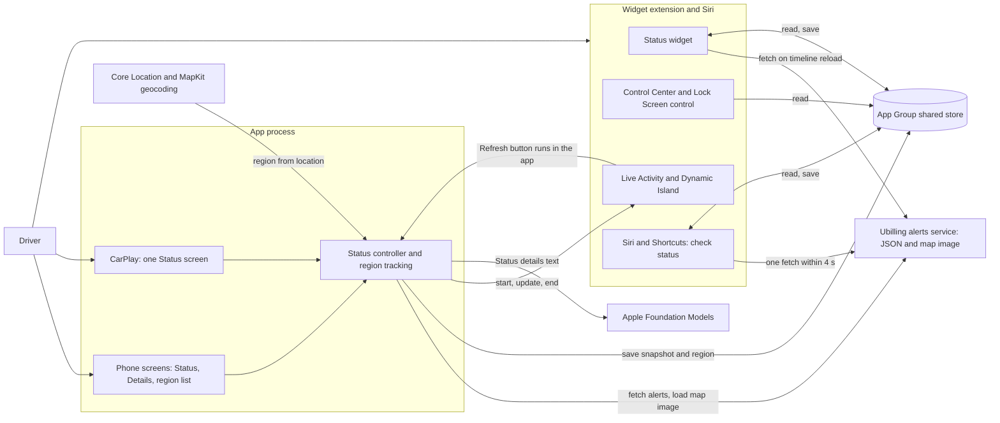
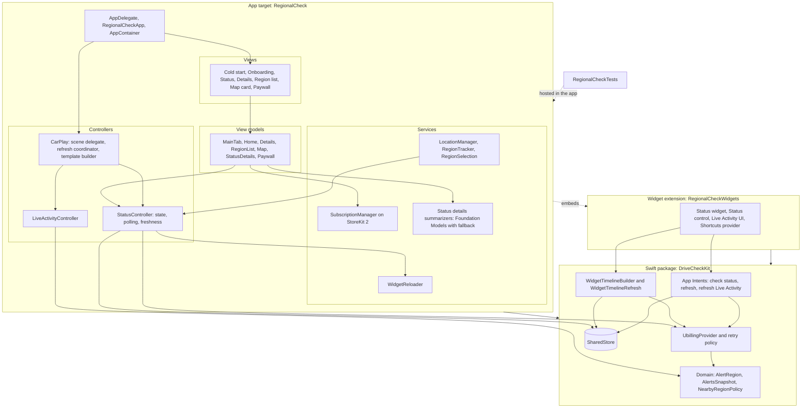
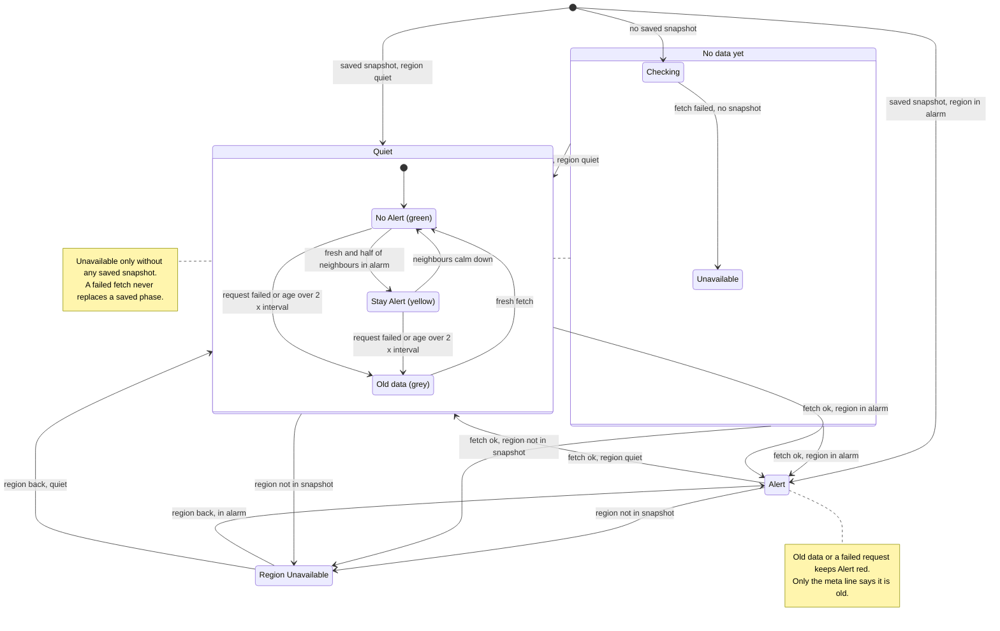
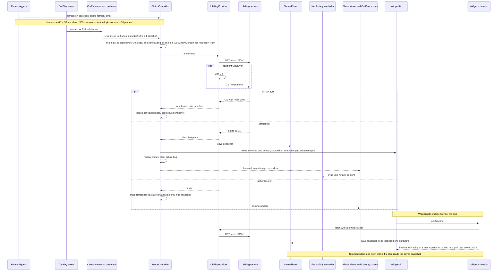
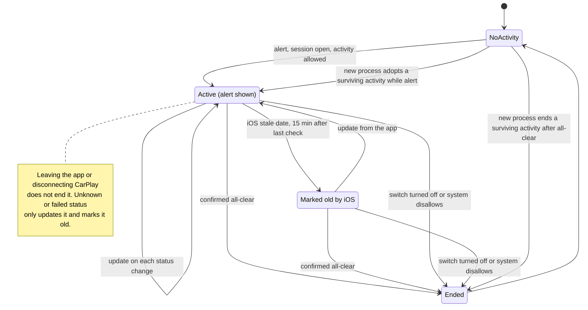

# Architecture diagrams

DriveCheckUA in five Mermaid diagrams: where the app sits, how the code is split, which states a region's status can be in, how a refresh travels, and how the Live Activity lives. Diagram names follow the C4 model and the arc42 views. Each diagram was checked against the source files named under it. The architecture text is in [architecture.md](architecture.md); product rules stay in [core.md](../core.md) and [requirements/](../requirements/); where a diagram and a document disagree, the code is what is drawn.

## 1. System context diagram

Who and what the app talks to. The only network source is the Ubilling alerts service, called by the app and by the widget and Siri paths separately; every other surface reads what the app (or the widget) saved to the App Group.

Checked against: `RegionalCheck/App/AppDelegate.swift`, `RegionalCheck/App/CarPlaySceneDelegate.swift`, `RegionalCheck/Resources/RegionalCheck.entitlements`, `RegionalCheck/AI/StatusDetailsProvider.swift`, `RegionalCheck/Data/ReverseGeocoding.swift`, `RegionalCheckWidgets/DriveCheckLiveActivity.swift` (bundle), `RegionalCheckWidgets/DriveCheckStatusControl.swift`, `RegionalCheckWidgets/DriveCheckShortcuts.swift`, `Packages/DriveCheckKit/Sources/DriveCheckKit/UbillingProvider.swift`, `.../SharedStore.swift`, `.../AlertStatusAnswerBuilder.swift`, `.../RefreshLiveActivityIntent.swift`.

## 2. Building block view

The three build targets and the layers inside the app. Arrows point from a caller to what it uses. The widget extension is embedded in the app and never shares its live objects; they meet only through the App Group store.

Checked against: `RegionalCheck.xcodeproj/project.xcproj` (targets and package membership), `RegionalCheck/App/AppContainer.swift`, `RegionalCheck/Views/StatusController.swift`, `RegionalCheck/Views/MainTabViewModel.swift`, `RegionalCheck/Views/HomeViewModel.swift`, `RegionalCheck/LiveActivity/LiveActivityController.swift`, `RegionalCheck/App/WidgetReloader.swift`, `RegionalCheck/Subscription/SubscriptionManager.swift`, `RegionalCheck/AI/FallbackStatusDetailsProvider.swift`, `Packages/DriveCheckKit/Package.swift` and its `Sources/`.

## 3. State diagram: alert status of a region

What the Status screen, CarPlay and the widget can show for the current region. The phase (Checking, No Alert or Stay Alert, Alert, Unavailable, Region Unavailable) comes from `StatusState`; old data and Stay Alert are not phases but colour rules layered on a quiet phase.

Checked against: `RegionalCheck/Views/StatusState.swift`, `RegionalCheck/Data/StatusStateResolver.swift`, `RegionalCheck/Views/StatusController.swift` (`applySnapshotToState`, `refresh`, `isDataStale`), `RegionalCheck/Data/DataFreshness.swift`, `RegionalCheck/App/Theme+Redesign.swift` (`RedesignStatusAccent`), `Packages/DriveCheckKit/Sources/DriveCheckKit/NearbyRegionPolicy.swift`, `.../WidgetTimelineBuilder.swift` (`isCaution`), `RegionalCheck/App/CarPlayLoadState.swift`. "Half of neighbours" is simplified: the full rule (Kyiv city exception, more than half of the country) is in `NearbyRegionPolicy.isSurrounded`.

## 4. Runtime view: refresh

From a trigger to the surfaces. Phone and CarPlay share one `StatusController`; the widget extension and Siri run their own fetch and meet the app only in the shared store.

Checked against: `RegionalCheck/Views/StatusController.swift` (`refresh`, `isFetchHeld`, `applyFetched`, periodic loop), `RegionalCheck/Data/RefreshPolicy.swift`, `RegionalCheck/Views/HomeView.swift`, `RegionalCheck/Views/HomeViewModel.swift`, `RegionalCheck/Views/MainTabViewModel.swift`, `RegionalCheck/Views/MainTabView.swift`, `RegionalCheck/App/CarPlayRefreshCoordinator.swift`, `RegionalCheck/App/CarPlaySceneDelegate.swift`, `Packages/DriveCheckKit/Sources/DriveCheckKit/UbillingProvider.swift`, `.../RetryAfterParser.swift`, `.../WidgetTimelineBuilder.swift`, `.../WidgetTimelineRefresh.swift`, `.../AlertStatusAnswerBuilder.swift`, `RegionalCheckWidgets/DriveCheckStatusWidget.swift`.

## 5. State diagram: Live Activity lifecycle

When the activity starts, updates and ends. It is started from a foreground session (phone or CarPlay) on an alert, and after that only a confirmed all-clear, or turning the activity off, ends it; leaving the app does not.

Checked against: `RegionalCheck/LiveActivity/LiveActivityLifecyclePolicy.swift`, `RegionalCheck/LiveActivity/LiveActivityController.swift`, `RegionalCheck/LiveActivity/LiveActivityStaleDate.swift`, `RegionalCheck/LiveActivity/LiveActivityRefresher.swift`, `RegionalCheck/LiveActivity/LiveActivityPreferenceStore.swift`, `RegionalCheck/LiveActivity/LiveActivityPermission.swift`, `RegionalCheck/App/RegionalCheckApp.swift`, `RegionalCheck/App/CarPlaySceneDelegate.swift`.
