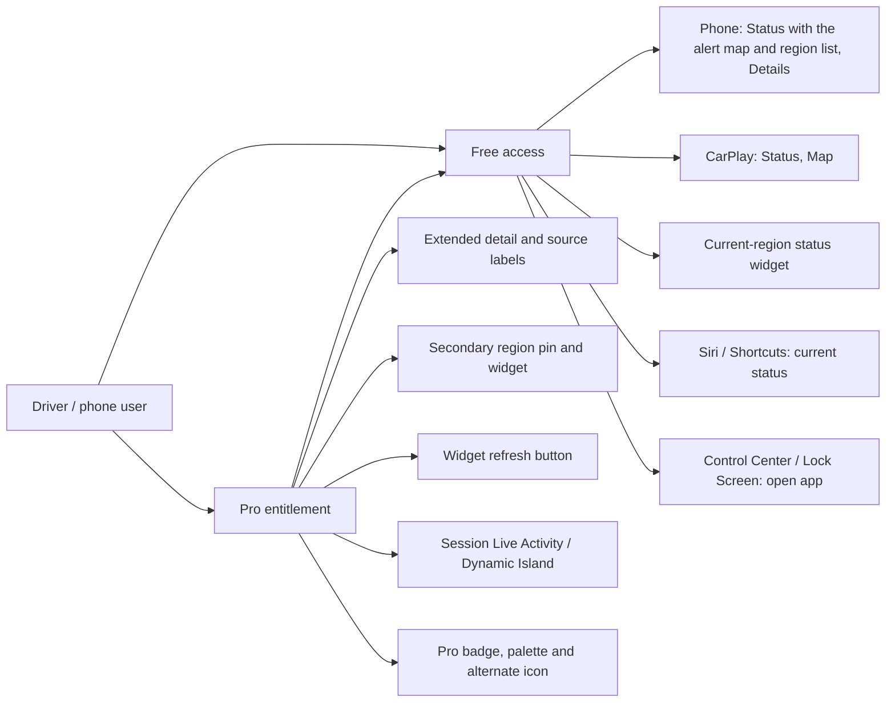
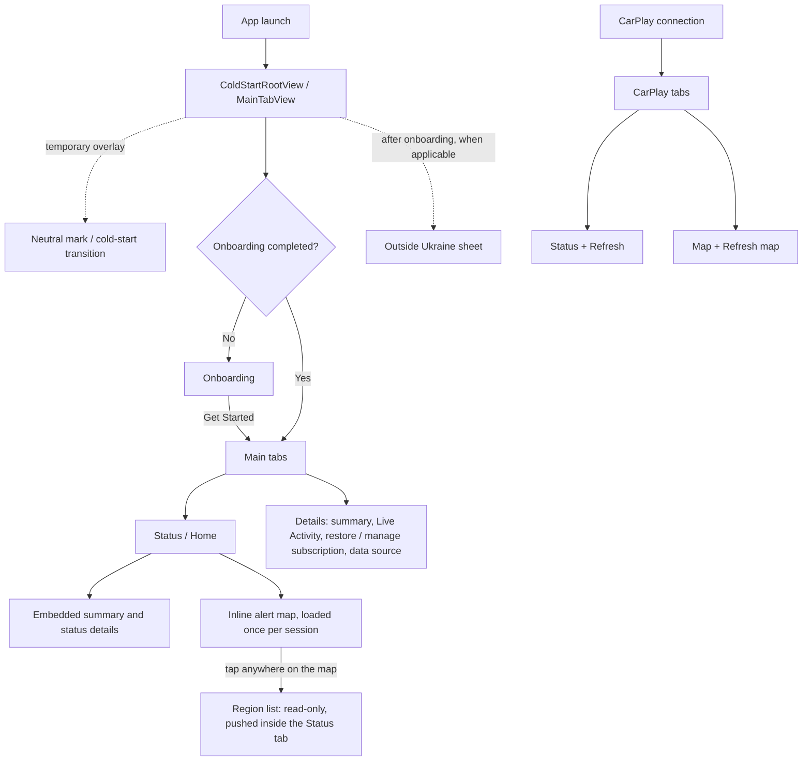
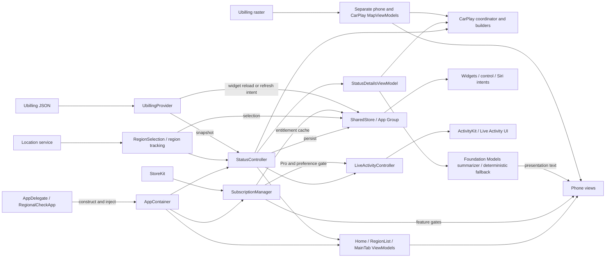

# Project map

Implementation map for the 3.0 release candidate, inspected on 2026-09-19.
This describes code present in the repository, not release acceptance or a new
product decision. Product rules remain in [core](../core.md) and
[surface requirements](../requirements/surfaces-and-pro-gating.md).

The three diagrams separate user access, navigation, and component ownership
so screen transitions cannot be mistaken for network calls. Mermaid source is
kept here and renders on GitHub; no exported image is required to maintain it.

## Users and surfaces

Free and Pro are entitlement states of the same user, not account roles.
There are no accounts, authentication, or administrator screens. The driver
uses CarPlay; the phone is the companion and configuration surface.

The current-region alarm/clear signal and alert map stay free. Pro loss hides
extended UI and reverts the icon; the stored secondary selection is retained.
Live Activity creation currently requires Pro and the Live Activity preference.

## Screens and navigation

Arrows below indicate entry or navigation, not strict timing. Cold-start overlay
and first-launch onboarding are separate root presentation mechanisms.
Status details are embedded content, not an additional phone screen.

| Surface or screen | Implementation entry point |
|---|---|
| Launch and root | [ColdStartRootView](../../RegionalCheck/Views/ColdStart/ColdStartRootView.swift), [MainTabView](../../RegionalCheck/Views/MainTabView.swift) |
| Status and summary | [HomeView](../../RegionalCheck/Views/HomeView.swift), [StatusView](../../RegionalCheck/Views/StatusView.swift), [StatusSummaryCard](../../RegionalCheck/Views/StatusSummaryCard.swift) |
| Region list (read-only, pushed from the map) | [RegionListView](../../RegionalCheck/Views/RegionListView.swift) |
| Inline alert map | [AlertMapCard](../../RegionalCheck/Views/MapCardView.swift) |
| Onboarding and location notice | [OnboardingView](../../RegionalCheck/Views/OnboardingView.swift), [OutsideUkraineInfoSheet](../../RegionalCheck/Views/OutsideUkraineInfoSheet.swift) |
| Details (summary, settings, purchases) | [DetailsView](../../RegionalCheck/Views/DetailsView.swift), [PaywallView](../../RegionalCheck/Views/Subscription/PaywallView.swift) |
| CarPlay templates | [CarPlaySceneDelegate](../../RegionalCheck/App/CarPlaySceneDelegate.swift) and Status / Map builders in the same directory |
| Widgets, control and Live Activity UI | [RegionalCheckWidgets](../../RegionalCheckWidgets/) |
| Siri and refresh intents | [DriveCheckKit](../../Packages/DriveCheckKit/Sources/DriveCheckKit/) |

Loading, quiet, alarm, stale, error and missing-region presentations are states
of these surfaces, not separate routes. DEBUG screenshot routes and explanation
trace sheets are development tools and are excluded from the user map.

## Component roles and data flow

Arrows show construction or information flow as labelled. App Group storage is
the cross-process boundary; extensions do not share the app's live controller.

| Role | Responsibility and boundary |
|---|---|
| AppContainer | Constructs live dependencies; owns shared instances and injects services. |
| StatusController | Shared status, refresh orchestration, freshness and reference-counted polling for app surfaces. |
| Feature ViewModels | Presentation state and user actions; views render and forward actions. |
| RegionSelection and location services | Current auto/manual region and optional secondary selection. |
| UbillingProvider / MapViewModel | JSON snapshot fetching / on-demand raster fetching; phone and CarPlay have separate map image state. |
| SharedStore | Persisted snapshot, selection and entitlement data used across processes. Widget reload and refresh intent paths can fetch and save snapshots. |
| StatusDetailsViewModel and summarizers | Derived explanatory text with deterministic fallback; do not replace the alert provider or authoritative status. |
| SubscriptionManager | StoreKit entitlement and feature gates, not a user account system. |
| LiveActivityController | Session lifecycle and content updates; widget extension renders the activity. |
| Runtime and tests | Build, lint and verification tooling; not shipped product screens or runtime services. |

## Known documentation boundaries

- CarPlay Map exists in code. [ADR 0011](../decisions/0011-carplay-alert-map-candidates.md)
  and release acceptance still need their recorded decision provenance reconciled.
- The surface matrix describes free Live Activity content, while the current
  creation gate requires Pro plus the preference. This map records that gate;
  it does not approve a change to the product contract.
- [Architecture](architecture.md) contains a target migration as well as current
  architecture. Its older statement that widget timelines never fetch must be
  read alongside its SharedStore section: widget reloads now make a best-effort
  fetch through `WidgetTimelineRefresh`.
- Release verification and device acceptance are tracked in the
  [closure checklist](../tasks/release-closure-execution.md), not inferred from
  the presence of a screen in this map.

Update this document when routes, entitlement gates, platform surfaces or
cross-process ownership change. Keep implementation links current and resolve
contract changes in requirements/ADRs before presenting them here as approved.
