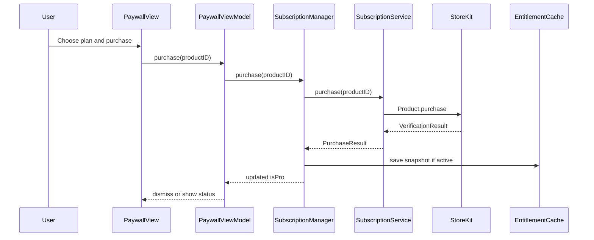
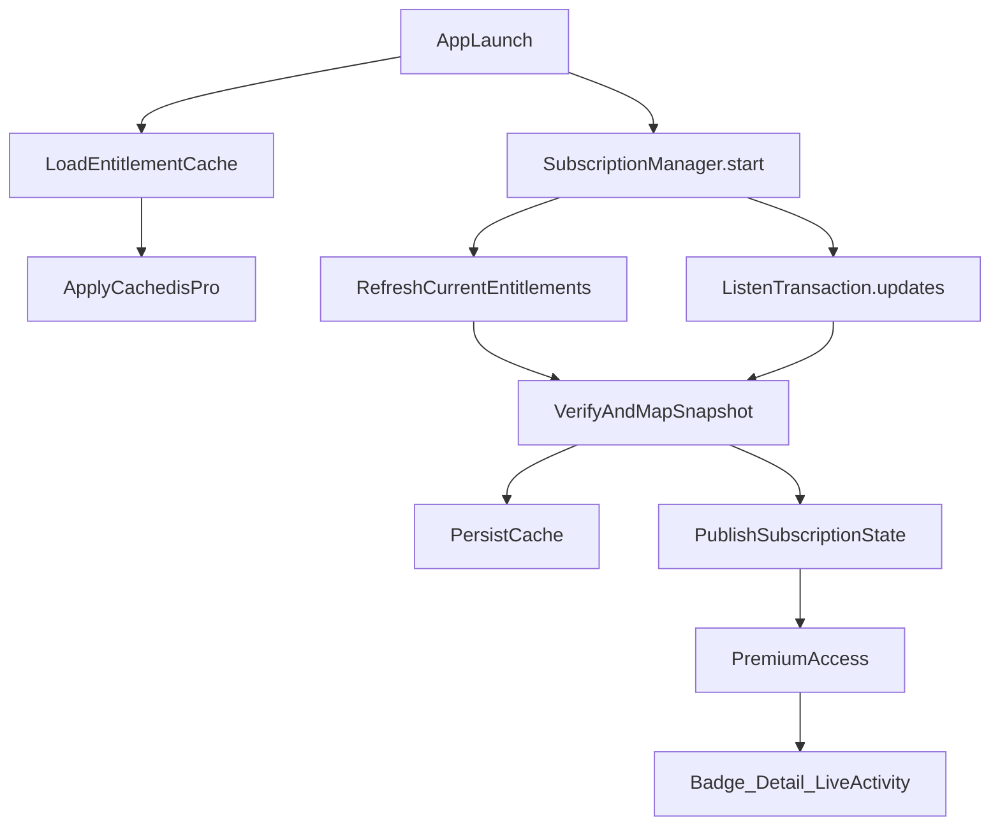
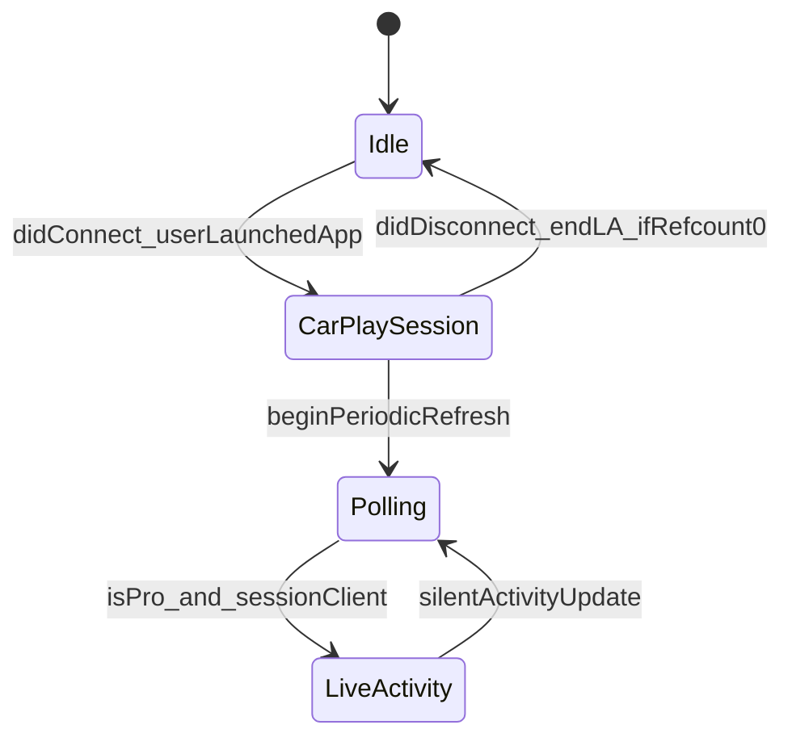

# StoreKit 2 Subscription — Feature Plan (Drive Check)

Status: Historical implementation plan. StoreKit 2 and Pro surfaces shipped; superseded details below are retained as engineering history.
Audience: local agent / human shipping with iOS Engineering Runtime.  
Product: **Drive Check** (scheme/target `RegionalCheck`, bundle `vil4max.RegionalCheck`).

Current product, architecture, and surface contracts live in [product-charter.md](product-charter.md), [architecture.md](architecture.md), and [surfaces.md](surfaces.md). Do not use the phase numbers, version numbers, file maps, or open items in this historical plan as current implementation instructions.

Related docs: [product-charter.md](product-charter.md), [architecture.md](architecture.md), [testflight-readiness.md](testflight-readiness.md), [analytics.md](analytics.md), [privacy-policy.html](privacy-policy.html), [terms-of-use.html](terms-of-use.html), [README_Subscriptions.md](../README_Subscriptions.md).

---

## 1. Goal

Demonstrate **production-grade StoreKit 2** and session **Live Activity** (portfolio / interviewer / TestFlight), not monetization.

Symbolic pricing; symbolic Pro entitlement. Core glanceable CarPlay experience stays free.

Success = a Senior iOS interviewer can install from TestFlight, purchase, restore, cancel, expire/relock, and review clean architecture including Pro Live Activity.

---

## 2. Decisions (locked)

| Topic | Decision |
| --- | --- |
| Billing | Apple StoreKit 2 only — no RevenueCat / third-party SDKs |
| Concurrency | `async/await`, no Combine |
| UI | SwiftUI; Observation where it fits existing patterns |
| Architecture | `Subscription/` module; MVVM at paywall edge; DI; StoreKit behind protocols |
| Product IDs | `regioncheck.pro.monthly`, `regioncheck.pro.yearly` |
| Prices | Monthly **$0.29**, Yearly **$0.99** (ASC minimum demo) |
| Free forever | Region check (iPhone + CarPlay) — never paywall-gated |
| Pro | Live Activity + badge + extended detail + home-screen widget refresh/source + Control Center control + Siri extended answer + secondary region pin + alternate icon |
| Not shipping | History, favorites, export, AI, background CarPlay monitor, local/push notifications as Pro |
| Widget home-screen | **Shipped in 2.0** — status + secondary region; timeline reads `SharedStore` only |
| CarPlay auto-poll without app open | **Not feasible** — do not claim |

---

## 3. Phase roadmap

### Phase 1 — StoreKit + Pro Live Activity (shipped in 1.2)

1. Subscription module (protocols, service, cache, manager).
2. StoreKit Configuration file + scheme wiring (`$0.29` / `$0.99`).
3. Paywall (native SwiftUI, App Review–compliant) listing Live Activity + badge + detail.
4. Entitlement gate: Live Activity, Pro badge, friendly extended detail (no notify).
5. Widget Extension + ActivityKit session Live Activity (iPhone foreground + CarPlay).
6. Non-UA location → Kyiv + one-shot info sheet.
7. Unit tests with mocked StoreKit boundary + source label + LA session recorder.
8. `README_Subscriptions.md` + privacy/terms HTML; ASC / Review checklists.

### Phase 2 — optional / deferred

- Home Screen Widget (stale timeline; weak StoreKit story).
- Push-to-update Live Activity / server push.
- Export snapshot, multi-region — only if portfolio needs more gates.
- Background monitoring — **out of product scope** (charter + Review).

---

## 4. Architecture (Phase 1)

### 4.1 Module layout

```
RegionalCheck/
  Subscription/
    SubscriptionProductID.swift
    SubscriptionProduct.swift
    SubscriptionState.swift
    PurchaseResult.swift
    SubscriptionError.swift
    PremiumFeature.swift             // proBadge, extendedDetail, liveActivity
    EntitlementSnapshot.swift
    SubscriptionServicing.swift
    StoreKitSubscriptionService.swift
    EntitlementCaching.swift
    EntitlementCache.swift
    SubscriptionManaging.swift
    SubscriptionManager.swift
    PremiumAccess.swift
    StatusSourceLabel.swift
  LiveActivity/
    DriveCheckActivityAttributes.swift
    LiveActivityControlling.swift
    LiveActivityController.swift     // session refcount + .immediate end
  Views/Subscription/
    PaywallView.swift
    PaywallViewModel.swift
RegionalCheckWidgets/
  DriveCheckLiveActivity.swift
  DriveCheckActivityAttributes.swift // keep in sync with app copy
```

Project uses `PBXFileSystemSynchronizedRootGroup` for app/tests; the widget extension target is in `project.pbxproj`.

### 4.2 Dependency rules

```text
Views / PaywallViewModel  →  SubscriptionManaging / PremiumAccess
SubscriptionManager       →  SubscriptionServicing + EntitlementCaching
StoreKitSubscriptionService → StoreKit 2 only
LiveActivityController    →  PremiumAccess (via SubscriptionManager) + ActivityKit
StatusController / CarPlay / scenePhase → LiveActivityControlling (no StoreKit)
```

- Views never talk to StoreKit (except `PaywallView` for `manageSubscriptionsSheet`).
- ViewModels contain no StoreKit product types beyond display models.
- Entitlement is derived from **verified** transactions (+ offline cache with expiry), never a manual “unlock” flag alone.
- Prefer injecting via `AppDependencies` (existing static bag pattern).

### 4.3 Flow diagrams

**Purchase**



**Entitlement + Transaction.updates**



**CarPlay session + Live Activity (honest scope)**



---

## 5. CarPlay + Live Activity — feasibility (resolved)

### Desired but not supported

“CarPlay hardware connected, Drive Check **not** open on head unit → auto-start polling / Activity.”

For **Driving Task** template apps:

- Scene connects when the user **launches** the app in CarPlay, not merely when CarPlay attaches.
- On leave/disconnect, refresh stops and CarPlay LA client is removed (`CarPlaySceneDelegate`).
- No reliable public API to treat “CarPlay connected” as a background execution grant for this category.

### Supported (Phase 1 / 1.2)

While **Drive Check** holds a session client:

- **iPhone foreground** (`scenePhase == .active`) and/or **CarPlay scene connected**.
- Existing 5-minute polling continues; Activity updates silently on phase/region change (no `AlertConfiguration`).
- Phone background alone ends Activity (`.immediate`) if CarPlay is not connected.
- Free users: no Activity; paywall lists Live Activity as Pro.

### Implementation hooks

- `LiveActivityController` refcount: `.phoneForeground` + `.carPlay`.
- Auth: `ActivityAuthorizationInfo().areActivitiesEnabled` before `Activity.request`.
- About toggle: “Live Activity during Drive Check session”.
- Pro unlock/relock mid-session: `update` / `syncLiveActivityContent` reconciles start/end.

---

## 6. Premium feature spec (Phase 1)

| Feature | Free | Pro |
| --- | --- | --- |
| Region status (phone + CarPlay) | Yes | Yes |
| Pro badge (About / status chrome) | Crown → paywall | Visible |
| Extended status detail | Basic title/explanation only | Friendly source label (raw Ubilling `source` hidden) |
| Session Live Activity | No (CTA to Pro) | Yes, while iPhone foreground or CarPlay scene |

---

## 7. Paywall & App Review

### Must include

- Benefits list (Live Activity + badge + detail; session-scoped honesty)
- Monthly + yearly plans with **price and duration** from StoreKit `Product`
- Purchase CTA
- Restore Purchases
- Privacy Policy link
- Terms of Use link (`docs/terms-of-use.html` / GitHub Pages)
- Auto-renew explanation (Apple standard subscription disclosure)
- Manage Subscription (`manageSubscriptionsSheet`)

### Must avoid

- Dark patterns, fake discounts, hidden price, forced purchase before core status
- Claiming background / CarPlay-without-app monitoring or push spam
- Unlocking Pro from a local bool without verification path

### Legal / privacy follow-ups

- [privacy-policy.html](privacy-policy.html): subscriptions via Apple; Live Activities; no new third-party analytics.
- App Privacy labels: purchases via Apple; Live Activities as applicable.
- Review Notes: symbolic Pro features; restore path; session Live Activity scope.

---

## 8. Live Activity vs Widget

| | Live Activity (shipped 1.2) | Widget (defer) |
| --- | --- | --- |
| Fit | High — glance during drive session | Medium — last snapshot only |
| StoreKit story | Strong (Pro gate + lifecycle) | Weak / awkward |
| Needs | Extension + ActivityKit | Extension + timeline |
| Updates without push | While app/session can update | Often stale |
| Solves CarPlay-without-app? | No | No |

**Shipped:** Live Activity bound to iPhone foreground + CarPlay scene. Skip Home Screen Widget unless needed later.

---

## 9. StoreKit edge cases (implement explicitly)

**Purchase:** success, user cancelled, pending, failed, verification failed.  
**Subscription:** expired, revoked, refunded, upgrade/downgrade (same group).  
**App:** first launch, reinstall, restore after reinstall, offline launch (cache), offline purchase attempt, network recovery, restart.  
**Runtime:** `Transaction.updates`, multiple updates, foreground refresh of entitlements.  
**Testing surfaces:** StoreKit Configuration, Sandbox, TestFlight.

Offline cache rules:

- On launch, show cached `isPro` only if `expirationDate > now` (or Apple’s renewal semantics reflected in last verified snapshot).
- Always re-validate when network/StoreKit available; revoked/expired → relock and clear or rewrite cache.

---

## 10. App Store Connect checklist (human)

- [ ] Subscription Group (e.g. “Drive Check Pro”)
- [ ] Products `regioncheck.pro.monthly` / `regioncheck.pro.yearly`
- [ ] Localization (EN minimum; align with app en/ru/uk if required)
- [ ] Pricing **$0.29** / **$0.99** (ASC minimum demo)
- [ ] Review screenshot / notes for subscription
- [ ] Privacy Policy URL + Terms URL
- [ ] Paid Apps Agreement / tax / banking current
- [ ] Metadata does not describe a background alert monitor
- [ ] Versioning: follow `AGENTS.md` (new marketing version → build **1**)

---

## 11. Testing checklist

### Local StoreKit Configuration

- [ ] Products load
- [ ] Purchase succeeds → Pro unlocks
- [ ] Restore works
- [ ] Expiration → relock
- [ ] Renewal (config speed-up) → stays Pro
- [ ] Cancelled purchase → friendly state, no unlock
- [ ] Live Activity: Pro unlock → Island; background phone alone → Activity ends (`.immediate`)
- [ ] CarPlay connected + Pro → Activity can stay while phone backgrounded

### Sandbox

- [ ] Sandbox Apple ID
- [ ] Purchase / restore
- [ ] Expiration / renew
- [ ] Upgrade monthly→yearly / downgrade behavior

### TestFlight

- [ ] Fresh install
- [ ] Purchase
- [ ] Reinstall + restore
- [ ] Offline launch with prior Pro cache
- [ ] CarPlay session: open app on head unit; Pro Live Activity on Island / Dashboard mirror
- [ ] Outside Ukraine: info sheet once; region stays Kyiv

### App Review dry-run

- [ ] All legal links work
- [ ] Restore visible
- [ ] Prices/durations visible
- [ ] No placeholder copy
- [ ] Core status usable without purchase
- [ ] No crashes on paywall cancel

---

## 12. Documentation deliverables (when implementing)

| Artifact | Purpose |
| --- | --- |
| `README_Subscriptions.md` | Architecture, flows, ASC setup, testing, troubleshooting, interview talking points |
| This file | Planning decisions + phased roadmap |
| `docs/terms-of-use.html` | Terms for paywall / ASC |
| Charter touch | Narrow exception note for symbolic Pro + session Live Activity |
| `architecture.md` | App + `RegionalCheckWidgets` Live Activity extension |

---

## 13. Senior review risks

| Risk | Mitigation |
| --- | --- |
| God `SubscriptionManager` | Keep service/cache separate; manager orchestrates only |
| StoreKit in ViewModels | Protocol boundary + tests on fakes |
| Trusting cache forever | Expiry + revalidate on `Transaction.updates` |
| Over-claiming CarPlay / background monitor | Copy + Review Notes; LA ends on phone background without CarPlay |
| Charter “Never notifications” | Notifications stay out; Pro value is session Live Activity |
| Extension / signing friction | Widget target in Archive scheme; `just verify` |
| Linux CI / cloud agent | Implement/verify on Mac with `just verify` + XcodeBuildMCP |

---

## 14. Implementation order (local Mac)

1. `just doctor` / `just diagnose` per [agent-pilot-brief.md](agent-pilot-brief.md).
2. Add `Subscription/` types + protocols + fake service for tests.
3. `StoreKitSubscriptionService` + `EntitlementCache` + `SubscriptionManager.start()`.
4. Wire `AppDependencies` + paywall entry from About / Pro badge.
5. Gate extended detail + badge + Live Activity session.
6. Widget Extension + ActivityKit presentations; scenePhase + CarPlay clients.
7. `Products.storekit` + scheme `StoreKitConfigurationFileReference`.
8. Localization strings (en/ru/uk) for paywall + Activity + outside-UA sheet.
9. Tests: entitlement mapping, cache expiry, purchase result mapping, feature gate, LA session recorder.
10. Docs: `README_Subscriptions.md`, terms, charter/architecture notes.
11. `just verify`.
12. ASC products + TestFlight validation on device + CarPlay if available.

Ask before commit/push unless the human waived that.

---

## 15. Interview talking points

- Entitlement from verified transactions + `Transaction.updates`, not a UserDefaults “isPremium” write from the purchase button.
- Offline cache is a **performance/UX** layer with expiry, not source of truth.
- Protocol-oriented StoreKit boundary for unit tests without StoreKit Configuration in CI.
- CarPlay Driving Task lifecycle honestly scoped; session Live Activity with refcount (phone foreground + CarPlay).
- Symbolic Pro keeps constitution (one screen / one region) while proving commercial StoreKit quality.

---

## 16. Open items (human / residual)

1. Hosted HTTPS Privacy/Terms (GitHub Pages) — confirm ASC App Privacy URL when editable.
2. Xcode Cloud Archive App Store export if still failing — inspect logs artifact.
3. Submit subscriptions with app version **1.2** after **1.1** leaves review.
4. Yearly vs monthly default on paywall (prefer yearly without fake “save XX%”).

---

## 17. Out of scope (explicit)

- Local/push notifications as Pro.
- Rewriting CarPlay UX or changing Ubilling provider.
- Accounts, backend receipt validation server, Offer Codes UI (can document later).
- RevenueCat / Superwall / Paywall vendors.
- Home Screen Widget.
- Claiming or implementing CarPlay-connected-but-app-closed polling.
- Push-to-update Live Activity.
